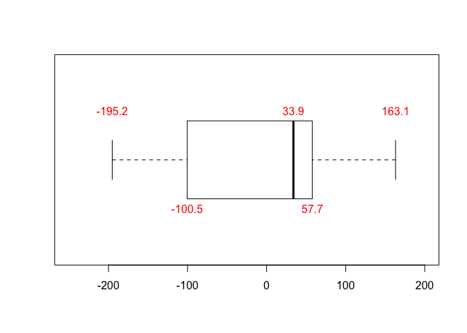
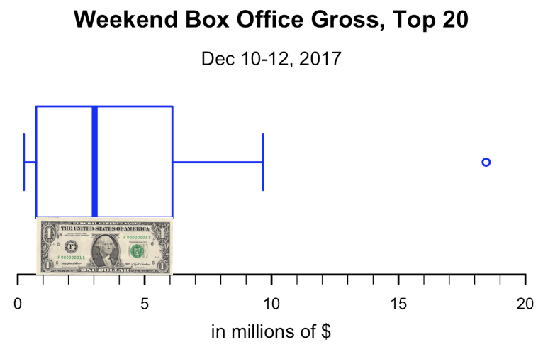
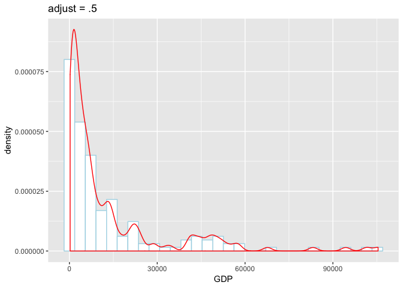
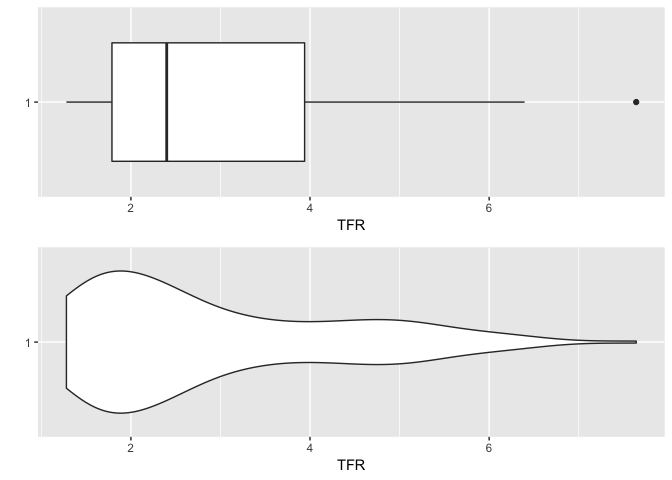
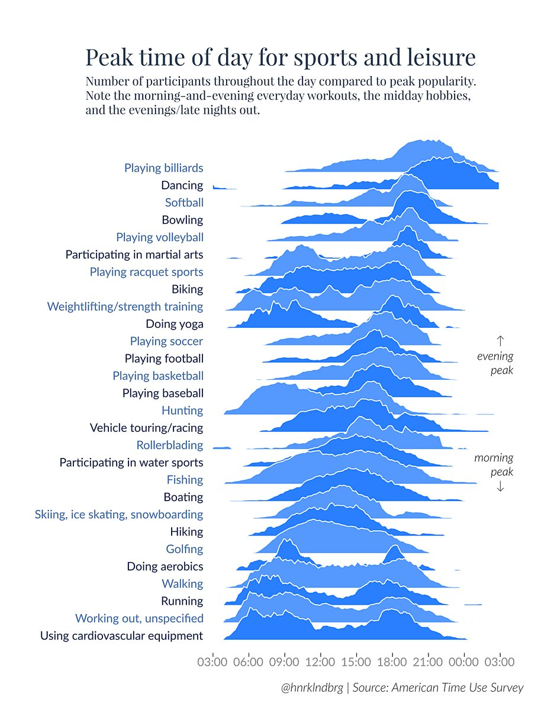
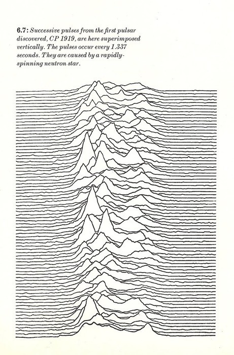

Continuous Variables, pt. 2
================

# Weekly Savings

``` r
library(tidyverse)
set.seed(5702)
WeeklySavings <- tibble(A = rexp(n = 52, rate = .015)) %>% 
  mutate(B = rnorm(n = 52, mean = median(A) - 2,
                    sd = 50),
         C = ifelse(test = B > median(B) + 10, 
                     yes = B * 10, no = B),
         D = ifelse(test = B < median(B) - 10,
                     yes = B - 100, no = B)) 
WeeklySavings <- WeeklySavings %>% 
  dplyr::mutate_all(sort)

head(WeeklySavings)
```

    ## # A tibble: 6 x 4
    ##       A     B     C     D
    ##   <dbl> <dbl> <dbl> <dbl>
    ## 1 0.909 -95.2 -95.2 -195.
    ## 2 1.50  -75.1 -75.1 -175.
    ## 3 2.02  -61.8 -61.8 -162.
    ## 4 2.40  -46.2 -46.2 -146.
    ## 5 3.27  -39.8 -39.8 -140.
    ## 6 4.77  -37.6 -37.6 -138.

``` r
#DT::datatable(WeeklySavings, options = list(paging=F)) %>% DT::formatCurrency(1:4)
```

# Histograms

``` r
tidySavings <- gather(WeeklySavings, person, amount)
ggplot(tidySavings, aes(amount)) + geom_histogram(fill = "blue") + facet_wrap(~person)
```


# Boxplots

``` r
boxplot(WeeklySavings, horizontal = TRUE, las = 1)
```


# Boxplot (Person “D”)

``` r
fivenumnames <- c("min", "lower-hinge", "median", "upper-hinge", "max")
D <- WeeklySavings$D
fivenum(D) %>% set_names(fivenumnames)
```

    ##         min lower-hinge      median upper-hinge         max 
    ##      -195.2      -100.5        33.9        57.7       163.1

``` r
boxplot(D, horizontal = TRUE, ylim=c(-250, 200))
text(fivenum(D)[c(1,3,5)], 1.25, round(fivenum(D)[c(1,3,5)],1), col = "red")
text(fivenum(D)[c(2,4)], .75, round(fivenum(D),1)[c(2,4)], col = "red")
```



# Boxplot with outliers (Person “C”)

``` r
C <- WeeklySavings$C
fivenum(C) %>% set_names(fivenumnames)
```

    ##         min lower-hinge      median upper-hinge         max 
    ##     -95.249      -0.473      33.889     577.408    1631.089

``` r
boxplot(C, horizontal = TRUE)
text(median(C), 1.25, round(median(C),1), col = "red")
text(fivenum(C)[c(2,4)], .75, round(fivenum(C),1)[c(2,4)], col = "red")
```


# What does it take to be an outlier?

# What does it take to be an outlier?


<https://www.explainxkcd.com/wiki/index.php/539:_Boyfriend>

# What does it take to be an outlier?

``` r
df <- read_csv("BoxOfficeMojo2019Jan0406.csv")
df$`Weekend Gross` <- df$`Weekend Gross`/1000000
```

``` r
b <- boxplot(df$`Weekend Gross`, 
        horizontal = TRUE, axes = F,
        ylim = c(0, 35), lty = "solid", 
        lwd = 2, border = "blue")
mtext("Weekend Box Office Gross, Top 20",
      side = 3, line = -1, cex = 1.5, 
      font = 2)
mtext("Jan 4-6, 2019",
      side = 3, line = -3, cex = 1.2)
mtext("in millions of $", side = 1, 
      line = .5, cex = 1.2)
axis(1, 0:35, labels = NA, line = -2)
axis(1, seq(0, 35, 5), lwd = 2, line = -2)
```


``` r
# Outlier = "Aquaman" $31 million
```

Source: <http://www.boxofficemojo.com/weekend/chart/>

# What does it take to be an outlier?

``` r
b <- boxplot(df$`Weekend Gross`, 
        horizontal = TRUE, axes = F,
        ylim = c(0, 35), lty = "solid", 
        lwd = 2, border = "blue")
mtext("Weekend Box Office Gross, Top 20",
      side = 3, line = -1, cex = 1.5, 
      font = 2)
mtext("Jan 4-6, 2019",
      side = 3, line = -3, cex = 1.2)
mtext("in millions of $", side = 1, 
      line = .5, cex = 1.2)
axis(1, 0:35, labels = NA, line = -2)
axis(1, seq(0, 35, 5), lwd = 2, line = -2)
outliers <- which(df$`Weekend Gross` %in% b$out)
text(b$out, 1.1, df$Title[outliers], col = "red")
```


``` r
# Outlier = "Aquaman"
```

# What does it take to be an outlier?

<center>



</center>

“H-spread” or fourth spread (upper hinge - lower hinge)

# What does it take to be an outlier?

<center>


</center>

fences:

1.5 x hinge spread above upper-hinge

1.5 x hinge spread below lower-hinge

# Fences

``` r
b <- boxplot(df$`Weekend Gross`, 
        horizontal = TRUE, axes = F,
        ylim = c(-10, 20), lty = "solid", 
        lwd = 2, border = "blue")
f <- fivenum(df$`Weekend Gross`)
fences <- c(f[2],f[4]) + c(-1,1)*1.5*(f[4]-f[2])
abline(v = fences, col = "green", lwd = 2)
```


fences:

1.5 x hinge spread above upper-hinge

1.5 x hinge spread below lower-hinge

# Tukey’s original boxplot

``` r
b <- boxplot(df$`Weekend Gross`, axes = F,
        ylim = c(-30, 45), lty = "solid", 
        lwd = 2, border = "blue")
innerfences <- c(f[2],f[4]) + c(-1,1)*1.5*(f[4]-f[2])
outerfences <- c(f[2],f[4]) + c(-1,1)*3*(f[4]-f[2])
abline(h = innerfences, col = "green", lwd = 2)
text(1, innerfences[1]+1.5, "inner fence (1.5 times hinge-spread from hinge)", col = "green")
abline(h = outerfences, col = "darkgreen", lwd = 2)
text(1, outerfences[1]+1.5, "outer fence (3 times hinge-spread from hinge)", col = "darkgreen")
diff <- outerfences[2] - innerfences[2]
text(1, diff/2 + innerfences[2]+2, "outside values", col = "blue")
text(1, diff/2 + outerfences[2], "far out values", col = "blue")
```


# Quartiles

``` r
boxoffice
```

    ##  [1]  0.703  0.923  1.005  1.168  1.609  1.808  1.843  1.903  2.147  2.368
    ## [11]  3.303  4.674  4.755  5.735  9.110 13.127 13.203 15.861 18.238 31.003

``` r
fivenum(boxoffice) %>% set_names(fivenumnames)
```

    ##         min lower-hinge      median upper-hinge         max 
    ##       0.703       1.709       2.835      11.118      31.003

``` r
quantile(boxoffice)
```

    ##     0%    25%    50%    75%   100% 
    ##  0.703  1.758  2.835 10.114 31.003

See: ?quantile for different methods

Sometimes boxplots are drawn using the IQR (interquartile range) instead
of hinge spread

# base R vs. ggplot2

``` r
library(mlbench)
data(Ozone)
boxplot(V5 ~ V3, data = Ozone)
```


``` r
ggplot(Ozone, aes(V3, V5)) + geom_boxplot()
```


# Box plot stats

``` r
# base R
boxplot.stats(df$`Weekend Gross`)
```

    ## $stats
    ## [1]  0.703  1.709  2.835 11.118 18.238
    ## 
    ## $n
    ## [1] 20
    ## 
    ## $conf
    ## [1] -0.489  6.160
    ## 
    ## $out
    ## [1] 31

``` r
# ggplot2
g <- ggplot(df, aes(1, `Weekend Gross`)) + geom_boxplot()
ggplot_build(g)$data[[1]]
```

    ##    ymin lower middle upper ymax outliers notchupper notchlower x PANEL
    ## 1 0.703  1.76   2.84  10.1 18.2       31       5.79     -0.117 1     1
    ##   group ymin_final ymax_final  xmin xmax xid newx new_width weight colour
    ## 1    -1      0.703         31 0.625 1.38   1    1      0.75      1 grey20
    ##    fill size alpha shape linetype
    ## 1 white  0.5    NA    19    solid

# Multiple box plots

``` r
library(ggplot2)
world <- read.csv("countries2012.csv")
ggplot(world, aes(x = CONTINENT, y = TFR)) + geom_boxplot()
```


# Multiple box plots

``` r
ggplot(world, aes(x = CONTINENT, y = TFR)) + geom_boxplot()
```


``` r
world %>% filter (TFR > 5) %>% filter(CONTINENT == "Asia") %>% select(COUNTRY, CONTINENT, TFR)
```

    ##       COUNTRY CONTINENT  TFR
    ## 1 Afghanistan      Asia 5.27
    ## 2 Timor-Leste      Asia 5.30

``` r
world %>% filter (TFR < 2) %>% filter(CONTINENT == "Oceania") %>% select(COUNTRY, CONTINENT, TFR)
```

    ##     COUNTRY CONTINENT  TFR
    ## 1 Australia   Oceania 1.92

# Reorder by median

``` r
g1 <- ggplot(world, aes(x = reorder(CONTINENT, -TFR, median),
                        y = TFR)) 
g1 + geom_boxplot()
```


# Reorder by maximum value

``` r
ggplot(world, aes(x = reorder(CONTINENT, TFR, max), 
                  y = TFR)) + geom_boxplot()
```


# Reorder by standard deviation

``` r
ggplot(world, aes(x = reorder(CONTINENT, TFR, sd), 
                  y = TFR)) + geom_boxplot()
```


# Add overall median line

``` r
g1 + geom_boxplot() + 
  geom_hline(yintercept = median(world$TFR), color = "red")
```


# Variable width box plots

``` r
g2 <- g1 + geom_boxplot(varwidth = TRUE)
g2
```


# Add continent country count

``` r
library(dplyr)
tfrorderdesc <- world %>% group_by(CONTINENT) %>%
  summarize(count = n(), median = median(TFR)) %>% arrange(-median)
g2 + annotate("text", x=1:6, y = 8, 
             label = tfrorderdesc$count, color = "blue",
             size = 6) +
    ggtitle("count:") + theme_grey(14) +
    theme(plot.title = element_text(color = "blue"))
```


# Horizontal boxplot

``` r
gb <- ggplot(world, aes(x = reorder(CONTINENT, TFR, median),
                        y = TFR)) + 
  geom_boxplot(varwidth = TRUE) +
  coord_flip() + theme_grey(14)
gb
```


# Not for discrete data

``` r
library(likert)
data("pisaitems")
p <- pisaitems[1:100, 2:7] %>% 
  dplyr::mutate_all(as.integer) %>% 
  dplyr::filter(complete.cases(.))

boxplot(p, las = 1, main = "PISA data (scale: 1 - 4)",
        border = "blue")
```


Source: R likert::pisaitems dataset

# Multiple density histograms, ordered by median

``` r
gh <- ggplot(world, aes(x = TFR, y = ..density..)) + 
    geom_histogram(color = "blue", fill = "lightblue") +
facet_wrap(~reorder(CONTINENT, -TFR, median), nrow = 6, strip.position = "top") +
  theme(strip.placement = "outside",
        strip.background = element_blank(),
        strip.text = element_text(face = "bold"))
gh
```


# Boxplots vs. histograms

``` r
library(gridExtra)
grid.arrange(gb, gh, nrow = 1)
```


# Frequency polygon

``` r
ggplot(world, aes(x = GDP)) + 
  geom_histogram(fill = "white", color = "lightblue") +
  geom_freqpoly() + theme_grey(14)
```


# Density histogram

``` r
g <- ggplot(world, aes(x = GDP, y = ..density..)) + 
  geom_histogram(fill = "white", color = "lightblue")
g
```


# Density curve

``` r
g + geom_density(color = "red")
```


# Density curve

``` r
g + geom_density(color = "red", adjust = .5) + ggtitle("adjust = .5")
```



# Density curve: varying smoothing bandwidths

``` r
g + geom_density(color = "red", bw = 2000) +
  geom_density(color = "blue", bw  = 4000) +
  geom_density(color = "green", bw = 16000) +
  geom_density(color = "purple", bw = 1000)
```


# Density curve: varying smoothing bandwidths (`ggvis`)

``` r
library(ggvis)
world %>% ggvis(~GDP) %>%
    layer_densities(adjust = input_slider(.1, 5,
                                          label = "bandwidth"))
```

<!--html_preserve-->

<div id="plot_id706948312-container" class="ggvis-output-container">

<div id="plot_id706948312" class="ggvis-output">

</div>

<div class="plot-gear-icon">

<nav class="ggvis-control">
<a class="ggvis-dropdown-toggle" title="Controls" onclick="return false;"></a>

<ul class="ggvis-dropdown">

<li>

Renderer:
<a id="plot_id706948312_renderer_svg" class="ggvis-renderer-button" onclick="return false;" data-plot-id="plot_id706948312" data-renderer="svg">SVG</a>
|
<a id="plot_id706948312_renderer_canvas" class="ggvis-renderer-button" onclick="return false;" data-plot-id="plot_id706948312" data-renderer="canvas">Canvas</a>

</li>

<li>

<a id="plot_id706948312_download" class="ggvis-download" data-plot-id="plot_id706948312">Download</a>

</li>

</ul>

</nav>

</div>

</div>

<script type="text/javascript">
var plot_id706948312_spec = {
  "data": [
    {
      "name": ".0/density1",
      "format": {
        "type": "csv",
        "parse": {
          "pred_": "number",
          "resp_": "number"
        }
      },
      "values": "\"pred_\",\"resp_\"\n-22943.6740064156,0.000000165516398939835\n-22349.2479762233,0.000000211003844151853\n-21754.821946031,0.000000266246742352465\n-21160.3959158388,0.000000335045525738769\n-20565.9698856465,0.000000418640884164435\n-19971.5438554542,0.000000519866156404682\n-19377.1178252619,0.000000643104393655015\n-18782.6917950696,0.000000788519387401514\n-18188.2657648774,0.000000965383054079528\n-17593.8397346851,0.00000117184281811468\n-16999.4137044928,0.00000141642053813035\n-16404.9876743005,0.00000170185289086573\n-15810.5616441082,0.00000203167561666555\n-15216.135613916,0.00000241584126488903\n-14621.7095837237,0.00000285093040707446\n-14027.2835535314,0.00000335279343132304\n-13432.8575233391,0.00000391584475254539\n-12838.4314931469,0.00000455024885611406\n-12244.0054629546,0.00000525891227028337\n-11649.5794327623,0.00000604018887548359\n-11055.15340257,0.00000690720314770721\n-10460.7273723777,0.00000784746197666159\n-9866.30134218545,0.00000887461009658464\n-9271.87531199318,0.00000997724236909166\n-8677.44928180089,0.0000111568764374257\n-8083.02325160862,0.0000124110740739521\n-7488.59722141634,0.0000137274122611724\n-6894.17119122406,0.0000151092776558126\n-6299.74516103178,0.0000165369456825302\n-5705.3191308395,0.0000180067239007011\n-5110.89310064722,0.0000195032979506986\n-4516.46707045494,0.0000210139533041338\n-3922.04104026266,0.0000225244628434157\n-3327.61501007038,0.0000240211208361417\n-2733.1889798781,0.0000254824741409327\n-2138.76294968582,0.0000268998815306414\n-1544.33691949354,0.0000282504895135495\n-949.910889301267,0.0000295223586702005\n-355.484859108987,0.0000307026580980619\n238.941171083294,0.0000317675172169071\n833.367201275571,0.0000327220986924238\n1427.79323146785,0.0000335314169039204\n2022.21926166013,0.0000342095080852683\n2616.64529185241,0.0000347362267517237\n3211.07132204469,0.0000351098078277463\n3805.49735223697,0.0000353367517277762\n4399.92338242925,0.0000353967120052132\n4994.34941262153,0.0000353181368143227\n5588.77544281381,0.0000350799962024588\n6183.20147300608,0.0000347082490911849\n6777.62750319836,0.0000342031029062287\n7372.05353339064,0.0000335723146452935\n7966.47956358292,0.0000328376075798357\n8560.9055937752,0.0000319937472932784\n9155.33162396748,0.0000310713913448626\n9749.75765415976,0.0000300714272793809\n10344.183684352,0.0000290139035593953\n10938.6097145443,0.0000279105549985853\n11533.0357447366,0.0000267721690598895\n12127.4617749289,0.0000256140710044241\n12721.8878051212,0.0000244448515710033\n13316.3138353134,0.000023276328684731\n13910.7398655057,0.0000221181967639827\n14505.165895698,0.0000209779431290128\n15099.5919258903,0.000019862170194139\n15694.0179560825,0.0000187794349913563\n16288.4439862748,0.0000177294686806145\n16882.8700164671,0.000016723353599168\n17477.2960466594,0.0000157566822561964\n18071.7220768517,0.0000148355456181183\n18666.1481070439,0.0000139598656736036\n19260.5741372362,0.0000131276455638115\n19855.0001674285,0.0000123443728154871\n20449.4261976208,0.0000116017701495195\n21043.8522278131,0.0000109063875388943\n21638.2782580053,0.0000102508333931113\n22232.7042881976,0.00000963623105738724\n22827.1303183899,0.00000906136859299947\n23421.5563485822,0.00000852127779779436\n24015.9823787745,0.00000802017428207726\n24610.4084089667,0.00000754996822612761\n25204.834439159,0.00000711436285743255\n25799.2604693513,0.00000670868236410955\n26393.6864995436,0.00000633256007957674\n26988.1125297359,0.00000598628988877894\n27582.5385599281,0.00000566543737249848\n28176.9645901204,0.0000053745670168804\n28771.3906203127,0.0000051074873803251\n29365.816650505,0.00000486710554130701\n29960.2426806973,0.00000465111154651262\n30554.6687108895,0.00000445871189288759\n31149.0947410818,0.00000429132864415334\n31743.5207712741,0.00000414493768352757\n32337.9468014664,0.00000402328767527954\n32932.3728316586,0.00000392161891663864\n33526.7988618509,0.00000384138142543235\n34121.2248920432,0.00000378101562313133\n34715.6509222355,0.00000373863147963399\n35310.0769524278,0.00000371524145387319\n35904.50298262,0.00000370676002654197\n36498.9290128123,0.00000371452966166663\n37093.3550430046,0.00000373492486616815\n37687.7810731969,0.00000376723566911596\n38282.2071033892,0.00000380978786743343\n38876.6331335814,0.00000386009334656898\n39471.0591637737,0.00000391740489070817\n40065.485193966,0.00000397881540705806\n40659.9112241583,0.00000404302220900325\n41254.3372543506,0.00000410793952003013\n41848.7632845428,0.00000417178196718111\n42443.1893147351,0.00000423269057339483\n43037.6153449274,0.00000428948398307068\n43632.0413751197,0.00000433953075259491\n44226.467405312,0.00000438272473898609\n44820.8934355042,0.00000441669531638645\n45415.3194656965,0.00000444100268205591\n46009.7454958888,0.00000445477477094971\n46604.1715260811,0.00000445638772563229\n47198.5975562733,0.00000444699819893646\n47793.0235864656,0.00000442381752318831\n48387.4496166579,0.00000438902641390188\n48981.8756468502,0.0000043412487525415\n49576.3016770425,0.00000428114654117679\n50170.7277072347,0.00000420956276910201\n50765.153737427,0.00000412569440911934\n51359.5797676193,0.00000403200571085484\n51954.0057978116,0.00000392744144356011\n52548.4318280039,0.00000381436946701031\n53142.8578581961,0.00000369310881949355\n53737.2838883884,0.00000356473050683485\n54331.7099185807,0.00000343080031121666\n54926.135948773,0.00000329168063604119\n55520.5619789653,0.000003149287017055\n56114.9880091575,0.00000300426214468987\n56709.4140393498,0.00000285795978742552\n57303.8400695421,0.00000271139386180647\n57898.2660997344,0.00000256560088070544\n58492.6921299266,0.00000242136448047263\n59087.1181601189,0.00000227998749057791\n59681.5441903112,0.0000021416922510885\n60275.9702205035,0.00000200768537979507\n60870.3962506958,0.00000187823084529878\n61464.822280888,0.00000175383187327239\n62059.2483110803,0.00000163528787090375\n62653.6743412726,0.00000152209815217102\n63248.1003714649,0.00000141569384190046\n63842.5264016572,0.00000131502326599615\n64436.9524318494,0.00000122088005146371\n65031.3784620417,0.00000113298956136909\n65625.804492234,0.00000105107602122481\n66220.2305224263,0.000000975689476571541\n66814.6565526186,0.000000905714595892013\n67409.0825828108,0.000000842022567600141\n68003.5086130031,0.000000783503898986589\n68597.9346431954,0.000000730370813703472\n69192.3606733877,0.000000682345743689589\n69786.78670358,0.000000638842374527871\n70381.2127337722,0.000000600283964877175\n70975.6387639645,0.00000056563801293969\n71570.0647941568,0.000000535351816239154\n72164.4908243491,0.000000508710123083189\n72758.9168545413,0.000000485657932134527\n73353.3428847336,0.000000466077949706359\n73947.7689149259,0.000000449415476538584\n74542.1949451182,0.000000436007941366827\n75136.6209753105,0.000000425089514186955\n75731.0470055027,0.000000416849174108765\n76325.473035695,0.000000410879895793128\n76919.8990658873,0.000000407010445205706\n77514.3250960796,0.000000405183040259686\n78108.7511262719,0.000000404960345017708\n78703.1771564641,0.000000406493987172807\n79297.6031866564,0.000000409305795273896\n79892.0292168487,0.000000413399196274987\n80486.455247041,0.000000418562330670744\n81080.8812772333,0.000000424629246068759\n81675.3073074255,0.000000431561595373864\n82269.7333376178,0.00000043913192778509\n82864.1593678101,0.000000447367476734758\n83458.5853980024,0.000000456097892612496\n84053.0114281947,0.000000465311441422826\n84647.4374583869,0.000000474961153374314\n85241.8634885792,0.000000484994284090106\n85836.2895187715,0.000000495452569473017\n86430.7155489638,0.00000050626392164593\n87025.141579156,0.000000517496399463536\n87619.5676093483,0.000000529105838695391\n88213.9936395406,0.000000541116994966413\n88808.4196697329,0.00000055353962074343\n89402.8456999252,0.000000566326029489962\n89997.2717301174,0.000000579522143985329\n90591.6977603097,0.000000593024143437115\n91186.123790502,0.000000606825908125053\n91780.5498206943,0.000000620832309429057\n92374.9758508866,0.000000634955649146517\n92969.4018810788,0.000000649085313437004\n93563.8279112711,0.000000663101708028999\n94158.2539414634,0.000000676803626741831\n94752.6799716557,0.000000690089917172173\n95347.106001848,0.000000702711396539274\n95941.5320320402,0.000000714509232434701\n96535.9580622325,0.00000072530464696302\n97130.3840924248,0.000000734775282284428\n97724.8101226171,0.00000074292384061188\n98319.2361528093,0.000000749251386770577\n98913.6621830016,0.000000753857050920682\n99508.0882131939,0.000000756390926366713\n100102.514243386,0.000000756732904985241\n100696.940273578,0.000000754885186768749\n101291.366303771,0.000000750426917086407\n101885.792333963,0.000000743704687381985\n102480.218364155,0.00000073425507365665\n103074.644394348,0.000000722410698058319\n103669.07042454,0.000000708064854559053\n104263.496454732,0.00000069124529577614\n104857.922484924,0.00000067228010080343\n105452.348515117,0.000000650938669373654\n106046.774545309,0.000000627793000403825\n106641.200575501,0.000000602759649703801\n107235.626605694,0.000000576231548087276\n107830.052635886,0.000000548423252469369\n108424.478666078,0.000000519537745659067\n109018.90469627,0.000000489955270933585\n109613.330726463,0.00000045983586042664\n110207.756756655,0.000000429536229992464\n110802.182786847,0.000000399304404805233\n111396.60881704,0.000000369386963416012\n111991.034847232,0.000000340009417791218\n112585.460877424,0.000000311453425572146\n113179.886907616,0.000000283779189602179\n113774.312937809,0.000000257359830363586\n114368.738968001,0.000000232129021386715\n114963.164998193,0.000000208326163280032\n115557.591028385,0.000000186001921096661\n116152.017058578,0.000000165132532434483\n116746.44308877,0.000000145945382646181\n117340.869118962,0.00000012818344316412\n117935.295149155,0.000000112098972201173\n118529.721179347,0.0000000974434410101401\n119124.147209539,0.000000084257982360077\n119718.573239731,0.0000000724937811380747\n120312.999269924,0.0000000619561001053717\n120907.425300116,0.0000000527657231500626\n121501.851330308,0.0000000446097847871719\n122096.277360501,0.0000000375651093463524\n122690.703390693,0.0000000314343729111468\n123285.129420885,0.0000000261505340592009\n123879.555451077,0.0000000216622985896903\n124473.98148127,0.0000000177960686769185\n125068.407511462,0.0000000145954896352965\n125662.833541654,0.0000000118677272751812\n126257.259571846,0.0000000096125315526298\n126851.685602039,0.00000000773849283545166\n127446.111632231,0.0000000061866304085184\n128040.537662423,0.00000000493202706253002\n128634.963692616,0.00000000389288213003093"
    },
    {
      "name": "scale/x",
      "format": {
        "type": "csv",
        "parse": {
          "domain": "number"
        }
      },
      "values": "\"domain\"\n-30522.6058913672\n136213.895577567"
    },
    {
      "name": "scale/y",
      "format": {
        "type": "csv",
        "parse": {
          "domain": "number"
        }
      },
      "values": "\"domain\"\n-0.00000176983560026066\n0.0000371665476054739"
    }
  ],
  "scales": [
    {
      "name": "x",
      "domain": {
        "data": "scale/x",
        "field": "data.domain"
      },
      "zero": false,
      "nice": false,
      "clamp": false,
      "range": "width"
    },
    {
      "name": "y",
      "domain": {
        "data": "scale/y",
        "field": "data.domain"
      },
      "zero": false,
      "nice": false,
      "clamp": false,
      "range": "height"
    }
  ],
  "marks": [
    {
      "type": "area",
      "properties": {
        "update": {
          "fill": {
            "value": "#333333"
          },
          "y2": {
            "scale": "y",
            "value": 0
          },
          "fillOpacity": {
            "value": 0.2
          },
          "x": {
            "scale": "x",
            "field": "data.pred_"
          },
          "y": {
            "scale": "y",
            "field": "data.resp_"
          },
          "stroke": {
            "value": "transparent"
          }
        },
        "ggvis": {
          "data": {
            "value": ".0/density1"
          }
        }
      },
      "from": {
        "data": ".0/density1"
      }
    },
    {
      "type": "line",
      "properties": {
        "update": {
          "stroke": {
            "value": "#000000"
          },
          "x": {
            "scale": "x",
            "field": "data.pred_"
          },
          "y": {
            "scale": "y",
            "field": "data.resp_"
          },
          "fill": {
            "value": "transparent"
          }
        },
        "ggvis": {
          "data": {
            "value": ".0/density1"
          }
        }
      },
      "from": {
        "data": ".0/density1"
      }
    }
  ],
  "legends": [],
  "axes": [
    {
      "type": "x",
      "scale": "x",
      "orient": "bottom",
      "layer": "back",
      "grid": true,
      "title": "GDP"
    },
    {
      "type": "y",
      "scale": "y",
      "orient": "left",
      "layer": "back",
      "grid": true,
      "title": "density"
    }
  ],
  "padding": null,
  "ggvis_opts": {
    "keep_aspect": false,
    "resizable": true,
    "padding": {},
    "duration": 250,
    "renderer": "svg",
    "hover_duration": 0,
    "width": 672,
    "height": 480
  },
  "handlers": null
};
ggvis.getPlot("plot_id706948312").parseSpec(plot_id706948312_spec);
</script>

<!--/html_preserve-->

See also: <http://ggvis.rstudio.com/0.1/quick-examples.html#histograms>

# Density curves

``` r
library(dplyr)
america <- world %>% filter(grepl("America", CONTINENT))
ggplot(america, aes(x = GDP, color = CONTINENT, fill = CONTINENT)) + 
  geom_density(alpha = .2)
```


# Density curves

``` r
library(dplyr)
america <- world %>% filter(grepl("America", CONTINENT))
ggplot(america, aes(x = GDP, color = CONTINENT, fill = CONTINENT)) + 
  geom_density(alpha = .2, adjust = .5)
```


# Violin plots

``` r
ggplot(world, aes(x = CONTINENT,
                  y = GDP)) +
    geom_violin() + 
    ggtitle("Gross Domestic Product") +
    coord_flip() + theme_grey(14)
```


# Violin plots, change bandwidth

``` r
ggplot(world, aes(x = CONTINENT,
                  y = GDP)) +
    geom_violin(adjust = 6) + 
    ggtitle("Gross Domestic Product") +
    coord_flip() + theme_grey(14)
```


# Violin plots, ordered by median

``` r
ggplot(world, aes(x = reorder(CONTINENT, GDP, median),
                  y = GDP)) +
    geom_violin() + 
    ggtitle("Gross Domestic Product") +
    coord_flip() + theme_grey(14)
```


# Box plot vs. violin plot

``` r
library(gridExtra)
g1 <- ggplot(world, aes(x = factor(1), y = TFR)) +
    geom_boxplot() + xlab("") + coord_flip()
g2 <- ggplot(world, aes(x = factor(1), y = TFR)) + 
    geom_violin() + xlab("") + coord_flip()
grid.arrange(g1, g2, ncol = 1)
```



# Ridgeline plot



Source: <https://eagereyes.org/blog/2017/joy-plots>

Additional
resources:

<http://blog.revolutionanalytics.com/2017/07/joyplots.html>

<https://blogs.scientificamerican.com/sa-visual/pop-culture-pulsar-origin-story-of-joy-division-s-unknown-pleasures-album-cover-video/>

# Ridgeline plot inspiration

Jocelyn Bell discovers first radio pulsars, 1967



# Ridgeline plot

``` r
library(ggridges)
gr <- ggplot(world, aes(x = GDP, y = reorder(CONTINENT, -GDP,
                                       median))) + 
  geom_density_ridges(fill = "blue", alpha = .5)
gr
```


# Ridgeline plot, change scale

``` r
ggplot(world, aes(x = GDP, 
                        y = reorder(CONTINENT, -GDP, median))) + 
  geom_density_ridges(fill = "blue", alpha = .5, scale = 1)
```


# Histogram vs. ridgeline

``` r
grid.arrange(gh, gr, nrow = 1)
```


# Ridgeline vs. boxplot


Source: <https://twitter.com/lenkiefer/status/916823350726610946>

# `ggridge` package

**CRAN** <https://CRAN.R-project.org/package=ggridges>

**Github** <https://github.com/clauswilke/ggridges>

**Package vignette(s)**
<https://cran.r-project.org/web/packages/ggridges/vignettes/introduction.html>

<https://cran.r-project.org/web/packages/ggridges/vignettes/gallery.html>

**Package manual**
<https://cran.r-project.org/web/packages/ggridges/ggridges.pdf>
