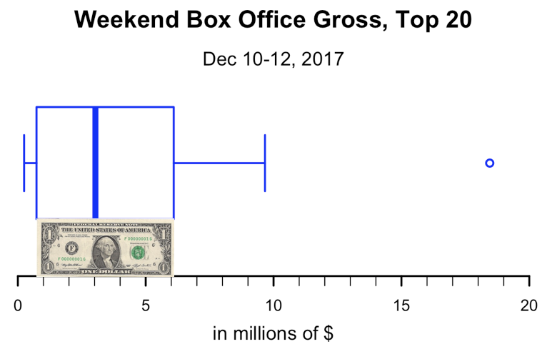
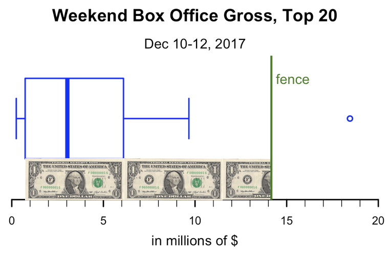
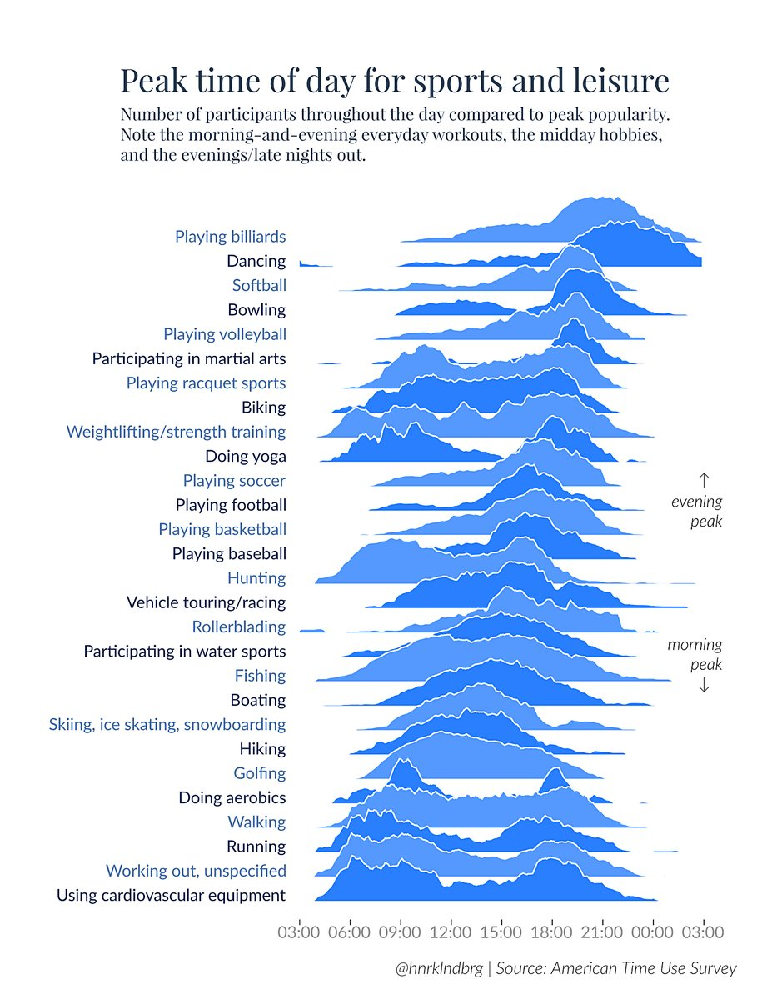
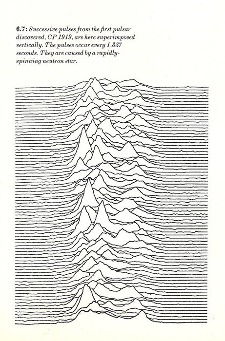
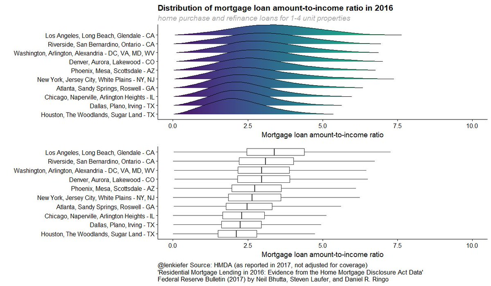

```{r setup, include=FALSE, cache=FALSE}
library(knitr)
options(digits = 3, scipen = 999)
knit_hooks$set(crop = hook_pdfcrop)
opts_chunk$set(fig.align='center', crop=TRUE, 
               cache=TRUE, message = FALSE,
               echo = FALSE, warning = FALSE)
opts_knit$set(global.par = TRUE)
```

# Weekly Savings

```{r}
library(tidyverse)
set.seed(5702)
WeeklySavings <- tibble(A = rexp(n = 52, rate = .015)) %>% 
  mutate(B = rnorm(n = 52, mean = median(A) - 2,
                    sd = 50),
         C = ifelse(test = B > median(B) + 10, 
                     yes = B * 10, no = B),
         D = ifelse(test = B < median(B) - 10,
                     yes = B - 100, no = B)) 
WeeklySavings <- WeeklySavings %>% 
  dplyr::mutate_all(sort)


DT::datatable(WeeklySavings, options = list(paging=F)) %>% DT::formatCurrency(1:4)
```

# Histograms

```{r}
tidySavings <- gather(WeeklySavings, person, amount)
ggplot(tidySavings, aes(amount)) + geom_histogram(fill = "blue") + facet_wrap(~person)
```

# Boxplots

```{r}
boxplot(WeeklySavings, horizontal = TRUE, las = 1)
```


# Boxplot (Person "D")

```{r}
fivenumnames <- c("min", "lower-hinge", "median", "upper-hinge", "max")
D <- WeeklySavings$D
fivenum(D) %>% set_names(fivenumnames)
boxplot(D, horizontal = TRUE, ylim=c(-250, 200))
text(fivenum(D)[c(1,3,5)], 1.25, round(fivenum(D)[c(1,3,5)],1), col = "red")
text(fivenum(D)[c(2,4)], .75, round(fivenum(D),1)[c(2,4)], col = "red")
```

# Boxplot with outliers (Person "C")

```{r}
C <- WeeklySavings$C
fivenum(C) %>% set_names(fivenumnames)
boxplot(C, horizontal = TRUE)
text(median(C), 1.25, round(median(C),1), col = "red")
text(fivenum(C)[c(2,4)], .75, round(fivenum(C),1)[c(2,4)], col = "red")
```


# What does it take to be an outlier?

# What does it take to be an outlier?


https://www.explainxkcd.com/wiki/index.php/539:_Boyfriend

# What does it take to be an outlier?

```{r}
df <- read_csv("BoxOfficeMojo2019Jan0406.csv")
df$`Weekend Gross` <- df$`Weekend Gross`/1000000
```

```{r}
b <- boxplot(df$`Weekend Gross`, 
        horizontal = TRUE, axes = F,
        ylim = c(0, 35), lty = "solid", 
        lwd = 2, border = "blue")
mtext("Weekend Box Office Gross, Top 20",
      side = 3, line = -1, cex = 1.5, 
      font = 2)
mtext("Jan 4-6, 2019",
      side = 3, line = -3, cex = 1.2)
mtext("in millions of $", side = 1, 
      line = .5, cex = 1.2)
axis(1, 0:35, labels = NA, line = -2)
axis(1, seq(0, 35, 5), lwd = 2, line = -2)
# Outlier = "Aquaman" $31 million
```

Source: http://www.boxofficemojo.com/weekend/chart/

# What does it take to be an outlier?
```{r}
b <- boxplot(df$`Weekend Gross`, 
        horizontal = TRUE, axes = F,
        ylim = c(0, 35), lty = "solid", 
        lwd = 2, border = "blue")
mtext("Weekend Box Office Gross, Top 20",
      side = 3, line = -1, cex = 1.5, 
      font = 2)
mtext("Jan 4-6, 2019",
      side = 3, line = -3, cex = 1.2)
mtext("in millions of $", side = 1, 
      line = .5, cex = 1.2)
axis(1, 0:35, labels = NA, line = -2)
axis(1, seq(0, 35, 5), lwd = 2, line = -2)
outliers <- which(df$`Weekend Gross` %in% b$out)
text(b$out, 1.1, df$Title[outliers], col = "red")
# Outlier = "Aquaman"
```


# What does it take to be an outlier?
<center>

</center>

"H-spread" or fourth spread (upper hinge - lower hinge)

# What does it take to be an outlier?

<center>

</center>

fences:  

1.5 x hinge spread above upper-hinge

1.5 x hinge spread below lower-hinge

# Fences

```{r}
b <- boxplot(df$`Weekend Gross`, 
        horizontal = TRUE, axes = F,
        ylim = c(-10, 20), lty = "solid", 
        lwd = 2, border = "blue")
f <- fivenum(df$`Weekend Gross`)
fences <- c(f[2],f[4]) + c(-1,1)*1.5*(f[4]-f[2])
abline(v = fences, col = "green", lwd = 2)

```

fences:  

1.5 x hinge spread above upper-hinge

1.5 x hinge spread below lower-hinge


# Tukey's original boxplot

```{r, fig.height = 6}
b <- boxplot(df$`Weekend Gross`, axes = F,
        ylim = c(-30, 45), lty = "solid", 
        lwd = 2, border = "blue")
innerfences <- c(f[2],f[4]) + c(-1,1)*1.5*(f[4]-f[2])
outerfences <- c(f[2],f[4]) + c(-1,1)*3*(f[4]-f[2])
abline(h = innerfences, col = "green", lwd = 2)
text(1, innerfences[1]+1.5, "inner fence (1.5 times hinge-spread from hinge)", col = "green")
abline(h = outerfences, col = "darkgreen", lwd = 2)
text(1, outerfences[1]+1.5, "outer fence (3 times hinge-spread from hinge)", col = "darkgreen")
diff <- outerfences[2] - innerfences[2]
text(1, diff/2 + innerfences[2]+2, "outside values", col = "blue")
text(1, diff/2 + outerfences[2], "far out values", col = "blue")

```

# Quartiles

```{r, echo = -1}
boxoffice <- sort(df$`Weekend Gross`)
boxoffice
fivenum(boxoffice) %>% set_names(fivenumnames)
quantile(boxoffice)
```

See: ?quantile for different methods

Sometimes boxplots are drawn using the IQR (interquartile range) instead of hinge spread

# base R vs. ggplot2
```{r, echo = TRUE}
library(mlbench)
data(Ozone)
boxplot(V5 ~ V3, data = Ozone)
ggplot(Ozone, aes(V3, V5)) + geom_boxplot()
```


# Box plot stats
```{r, echo=TRUE}
# base R
boxplot.stats(df$`Weekend Gross`)

# ggplot2
g <- ggplot(df, aes(1, `Weekend Gross`)) + geom_boxplot()
ggplot_build(g)$data[[1]]
```


# Multiple box plots
```{r multboxplots}
library(ggplot2)
world <- read.csv("countries2012.csv")
ggplot(world, aes(x = CONTINENT, y = TFR)) + geom_boxplot()
```

# Multiple box plots
```{r}
ggplot(world, aes(x = CONTINENT, y = TFR)) + geom_boxplot()

world %>% filter (TFR > 5) %>% filter(CONTINENT == "Asia") %>% select(COUNTRY, CONTINENT, TFR)
world %>% filter (TFR < 2) %>% filter(CONTINENT == "Oceania") %>% select(COUNTRY, CONTINENT, TFR)
```


# Reorder by median
```{r}
g1 <- ggplot(world, aes(x = reorder(CONTINENT, -TFR, median),
                        y = TFR)) 
g1 + geom_boxplot()
```

# Reorder by maximum value
```{r}
ggplot(world, aes(x = reorder(CONTINENT, TFR, max), 
                  y = TFR)) + geom_boxplot()
```

# Reorder by standard deviation
```{r}
ggplot(world, aes(x = reorder(CONTINENT, TFR, sd), 
                  y = TFR)) + geom_boxplot()
```

# Add overall median line
```{r withmedian}
g1 + geom_boxplot() + 
  geom_hline(yintercept = median(world$TFR), color = "red")
```

# Variable width box plots
```{r varwidth}
g2 <- g1 + geom_boxplot(varwidth = TRUE)
g2
```

# Add continent country count

```{r varwidthnum}
library(dplyr)
tfrorderdesc <- world %>% group_by(CONTINENT) %>%
  summarize(count = n(), median = median(TFR)) %>% arrange(-median)
g2 + annotate("text", x=1:6, y = 8, 
             label = tfrorderdesc$count, color = "blue",
             size = 6) +
    ggtitle("count:") + theme_grey(14) +
    theme(plot.title = element_text(color = "blue"))
```

# Horizontal boxplot
```{r varwidthflip}
gb <- ggplot(world, aes(x = reorder(CONTINENT, TFR, median),
                        y = TFR)) + 
  geom_boxplot(varwidth = TRUE) +
  coord_flip() + theme_grey(14)
gb
```

# Not for discrete data

```{r}
library(likert)
data("pisaitems")
p <- pisaitems[1:100, 2:7] %>% 
  dplyr::mutate_all(as.integer) %>% 
  dplyr::filter(complete.cases(.))

boxplot(p, las = 1, main = "PISA data (scale: 1 - 4)",
        border = "blue")
```

Source: R likert::pisaitems dataset


# Multiple density histograms, ordered by median
```{r dh, fig.width = 8}
gh <- ggplot(world, aes(x = TFR, y = ..density..)) + 
    geom_histogram(color = "blue", fill = "lightblue") +
facet_wrap(~reorder(CONTINENT, -TFR, median), nrow = 6, strip.position = "top") +
  theme(strip.placement = "outside",
        strip.background = element_blank(),
        strip.text = element_text(face = "bold"))
gh
```

# Boxplots vs. histograms
```{r, fig.width=8}
library(gridExtra)
grid.arrange(gb, gh, nrow = 1)
```

# Frequency polygon 
```{r}
ggplot(world, aes(x = GDP)) + 
  geom_histogram(fill = "white", color = "lightblue") +
  geom_freqpoly() + theme_grey(14)
```

# Density histogram
```{r}
g <- ggplot(world, aes(x = GDP, y = ..density..)) + 
  geom_histogram(fill = "white", color = "lightblue")
g
```

# Density curve
```{r}
g + geom_density(color = "red")
```

# Density curve
```{r}
g + geom_density(color = "red", adjust = .5) + ggtitle("adjust = .5")
```


# Density curve: varying smoothing bandwidths
```{r}
g + geom_density(color = "red", bw = 2000) +
  geom_density(color = "blue", bw  = 4000) +
  geom_density(color = "green", bw = 16000) +
  geom_density(color = "purple", bw = 1000)
```


# Density curve: varying smoothing bandwidths (`ggvis`)
```{r}
library(ggvis)
world %>% ggvis(~GDP) %>%
    layer_densities(adjust = input_slider(.1, 5,
                                          label = "bandwidth"))
```

See also:  http://ggvis.rstudio.com/0.1/quick-examples.html#histograms

# Density curves
```{r}
library(dplyr)
america <- world %>% filter(grepl("America", CONTINENT))
ggplot(america, aes(x = GDP, color = CONTINENT, fill = CONTINENT)) + 
  geom_density(alpha = .2)
```

# Density curves
```{r}
library(dplyr)
america <- world %>% filter(grepl("America", CONTINENT))
ggplot(america, aes(x = GDP, color = CONTINENT, fill = CONTINENT)) + 
  geom_density(alpha = .2, adjust = .5)
```

# Violin plots
```{r violin}
ggplot(world, aes(x = CONTINENT,
                  y = GDP)) +
    geom_violin() + 
    ggtitle("Gross Domestic Product") +
    coord_flip() + theme_grey(14)
```

# Violin plots, change bandwidth
```{r violin2}
ggplot(world, aes(x = CONTINENT,
                  y = GDP)) +
    geom_violin(adjust = 6) + 
    ggtitle("Gross Domestic Product") +
    coord_flip() + theme_grey(14)
```

# Violin plots, ordered by median
```{r violin3}
ggplot(world, aes(x = reorder(CONTINENT, GDP, median),
                  y = GDP)) +
    geom_violin() + 
    ggtitle("Gross Domestic Product") +
    coord_flip() + theme_grey(14)
```

# Box plot vs. violin plot
```{r bvs}
library(gridExtra)
g1 <- ggplot(world, aes(x = factor(1), y = TFR)) +
    geom_boxplot() + xlab("") + coord_flip()
g2 <- ggplot(world, aes(x = factor(1), y = TFR)) + 
    geom_violin() + xlab("") + coord_flip()
grid.arrange(g1, g2, ncol = 1)
```


# Ridgeline plot



Source: https://eagereyes.org/blog/2017/joy-plots

Additional resources:

http://blog.revolutionanalytics.com/2017/07/joyplots.html

https://blogs.scientificamerican.com/sa-visual/pop-culture-pulsar-origin-story-of-joy-division-s-unknown-pleasures-album-cover-video/

# Ridgeline plot inspiration

Jocelyn Bell discovers first radio pulsars, 1967



# Ridgeline plot
```{r}
library(ggridges)
gr <- ggplot(world, aes(x = GDP, y = reorder(CONTINENT, -GDP,
                                       median))) + 
  geom_density_ridges(fill = "blue", alpha = .5)
gr
```

# Ridgeline plot, change scale
```{r}
ggplot(world, aes(x = GDP, 
                        y = reorder(CONTINENT, -GDP, median))) + 
  geom_density_ridges(fill = "blue", alpha = .5, scale = 1)
```

# Histogram vs. ridgeline
```{r, fig.width=8}
grid.arrange(gh, gr, nrow = 1)
```

# Ridgeline vs. boxplot


Source: https://twitter.com/lenkiefer/status/916823350726610946


# `ggridge` package

**CRAN**
https://CRAN.R-project.org/package=ggridges 

**Github**
https://github.com/clauswilke/ggridges

**Package vignette(s)**
https://cran.r-project.org/web/packages/ggridges/vignettes/introduction.html

https://cran.r-project.org/web/packages/ggridges/vignettes/gallery.html

**Package manual**
https://cran.r-project.org/web/packages/ggridges/ggridges.pdf
